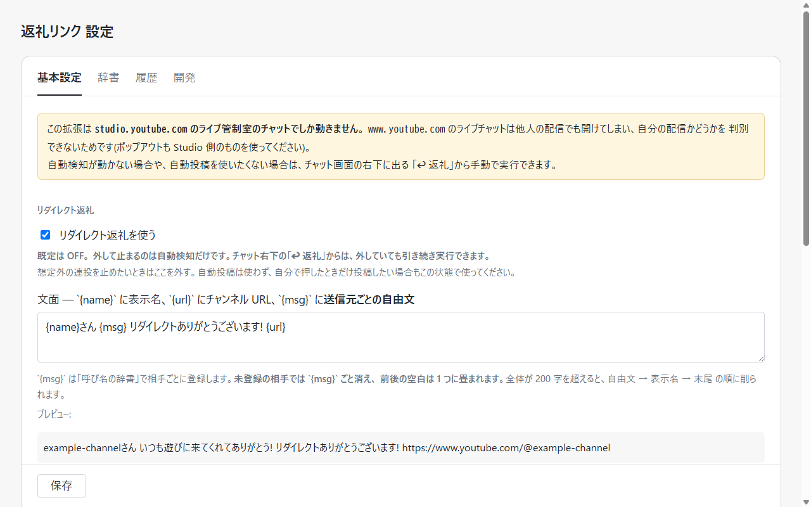

# 返礼リンク (yt-redirect-pin)

**YouTube のライブ配信で他チャンネルからライブリダイレクトを受け取ったとき、送信元チャンネルの
URL をライブチャットへ投稿して固定する Chrome 拡張 (MV3)。**
**辞書で「コメントに反応する」を付けた人のコメントにも反応できます (既定 OFF / 固定はしません)。**

[](https://github.com/max-enterme/yt-redirect-pin/releases/latest)
[](LICENSE)

説明ページ → **<https://max-enterme.github.io/yt-redirect-pin/>**

---

## ⚠️ 使う前に読んでください

**この拡張は Chrome ウェブストアには出していません。** 出さないと決めました。

ストアの審査は**単一用途・権限・データの扱い**を見るもので、**YouTube の規約に触れるかは見てくれません。**
つまり審査を通っても「規約上セーフ」の裏付けにはならず、**通ったという事実が誤った安心になる。**
そしてストアに出すというのは、自分がリスクを取ることではなく、**事情を知らない人にリスクを負わせること**でもあります。

- **YouTube の規約上、グレーな行為を含みます。**
  利用規約は「自動化された手段を使用して本サービスにアクセスすること」を禁じています。
  本拡張がこれに当たるかは文言からは決まらず、**YouTube の公式見解も、この形での処分の前例も
  見つかっていません。**「安全である証拠」ではなく「証拠が無い」という状態です
  (→ [docs/d3-automation-policy.md](docs/d3-automation-policy.md))。
- **投稿はあなた自身のアカウントの名義で行われます。** 何かあったとき失うのはあなたのチャンネルです。
- **送信元の検知は推測を含みます。取り違えると、その人に宛てて書いた一文 (`{msg}`) が
  そのまま別の相手への投稿に載ります。** 呼び名の取り違えなら「誰かの名前」が出るだけですが、
  自由文は特定の相手に宛てて書いたものなので、宛先を間違えると内容そのものが事故になります。
  実際にこの拡張は送信元の取り違えを**過去に 2 回起こしています**
  (→ [docs/t1-findings.md](docs/t1-findings.md))。**そこに書けない内容は書かないでください。**
- **ほとんど検証されていません。** 実配信で通ったのは**日本語 UI・Studio のチャット・1 環境だけ**です。
  既定の固定モード `ifEmpty` の判定、自由文 (`{msg}`) 入りの文面、コメント返しは
  **いずれも実配信での通し確認が未実施**です (→ [状態](#状態))。
- **YouTube の画面構造の変更で、ある日突然動かなくなります。** DOM に依存しているためです。
- **未署名の拡張です。** デベロッパーモードでの読み込みになり、自動更新もされません
  (新しい版への入れ替え方は [docs/install.md](docs/install.md#新しい版に入れ替える))。
- **自動投稿の引き金は 2 種類あります** — リダイレクトの受信と、**辞書で「コメントに反応する」を
  付けた人のコメント**。**後者は既定 OFF で、辞書側のフラグも既定 false です**
  (リダイレクトを受けて自動で一覧に載った相手にも付きません)。**両方を自分で ON にしない限り、
  挙動は 003 までと同じです。** ON にすると**投稿の頻度は上がります** —
  コメントはリダイレクトより桁違いに多いためです (→ [コメント返し](#コメント返し-既定-off))。
- **インストール時の許可表示に `www.youtube.com` が出ます。** 拡張が読み込まれて動くのは
  今までどおり `studio.youtube.com` のライブ管制室のチャットだけで、この許可は
  **設定画面がチャンネル ID を控えに行く**ためだけのものです (→ [保存されるもの](#保存されるもの))。

**リスクを自分で判断・管理できる人が、自己責任で使うことを想定しています。**
判断がつかない場合は、使わないでください。作者は結果について責任を負いません ([LICENSE](LICENSE))。

### チャットへの投稿を人の操作だけに限りたいとき

**自動投稿を切って「手動ボタンからだけ使う」こともできます。** 設定で

1. 「リダイレクトを自動検知して投稿する」を**外す**
2. 「コメントに反応して投稿する」も**外したままにする** (**既定 OFF**。①を外してもこちらは
   独立していて、ON なら投稿されます)
3. 「ライブチャットの右下に『↩ 返礼』を出す」を**入れる** (**このボタンは既定では出ません** —
   配信画面への映り込み対策)

の 3 つを満たすと、**ライブチャットへの投稿は、人が「↩ 返礼」を押したときにしか起きません。**
迷うならまずこの形で。(検知そのものは動き続けるので、**辞書への自動登録は行われます** —
一覧に相手が載るだけで、チャットには何も出ません。)

---

## 何をするか

```
① 検知          ② 投稿                        ③ 固定
リダイレクトの   「◯◯さんからリダイレクト        その投稿を
受信通知を検知    ありがとうございます! URL」    チャット上部に固定
                 をチャットへ投稿
```

配信中に「誰から来たのか」を確認して、チャンネル URL をコピーして、投稿して、固定する ——
この一連の操作を、リダイレクトを受け取った時点で肩代わりします。

| | |
|---|---|
| 投稿文 | テンプレートで編集できる (`{name}` に表示名、`{url}` にチャンネル URL、`{msg}` に送信元ごとの自由文) |
| 呼び名・自由文 | 送信元ごとに呼び名と一言 (`{msg}`) を登録できる。リダイレクトを受けた相手は自動で一覧に載る (どちらも空のまま) |
| 固定モード | `off` (固定しない) / `ifEmpty` (既存の固定が無いときだけ) / `always` (上書き) |
| 多重発火の抑止 | 同一送信元はクールダウン内 1 回まで (既定 6 時間)。**同じ配信の中でだけ**効き、投稿履歴に基づくのでリロードをまたいでも引き継がれる (**配信 ID を取れない画面では、前の起動から読み戻した記録に 6 時間の下限**をかけます → [配信 ID が取れないとき](#配信-id-が取れないとき)) |
| 手動トリガー | チャット右下の「↩ 返礼」。**既定は OFF** (配信画面への映り込み対策)。設定で出せば、自動投稿を切っていても実行できる |
| 止める | 設定の「リダイレクトを自動検知して投稿する」を外せば、リダイレクト返礼の自動投稿は即止まる (**コメント返しは別のスイッチ**) |
| 診断ログ | **既定は OFF。**自動検知が動かないときの切り分け用で、ON にすると**通知の候補になりうるノードだけ**をコンソールに出す (通常のコメントは除外していますが、**それを含む親ノードが引っかかると本文が混ざることがあります**。配信画面に開発者ツールを映さないこと) |

**投稿するのは `studio.youtube.com` のライブ管制室のチャットだけです。**
`www.youtube.com` のライブチャットは他人の配信でも開けてしまい、自分の配信かどうかを
判別できないため、**拡張はそこには読み込まれません** (意図的です)。

### 前提

| | |
|---|---|
| ブラウザ | Chrome (Chromium 系なら概ね動くはずですが、確認しているのは Chrome だけです) |
| 画面 | YouTube Studio のライブ管制室のチャット |
| **表示言語** | **YouTube Studio が日本語であること。** 検知はリダイレクト通知の**文言**に依存しているため、他言語では反応しません |



## 入れかた

1. [Releases](https://github.com/max-enterme/yt-redirect-pin/releases/latest) から
   `yt-redirect-pin-<version>.zip` を落とす
2. 展開する。**消さない場所に置く** (Chrome はこのフォルダを読み続けます)
3. Chrome で `chrome://extensions` を開き、右上の **「デベロッパー モード」** を ON
4. **「パッケージ化されていない拡張機能を読み込む」** → 展開したフォルダを選ぶ

詳しい手順・設定・動かないときの切り分けは **[docs/install.md](docs/install.md)**。

## コメント返し (既定 OFF)

リダイレクトの受信とは**別の引き金**です。**辞書で「コメントに反応する」を付けた人**が
ライブチャットにコメントすると、その人のチャンネル URL を投稿します。

| | |
|---|---|
| 有効にする | 設定の**「コメントに反応して投稿する」**(**既定 OFF**) と、**辞書の行ごとのフラグ**(**既定 false**) の両方が要る。リダイレクトを受けて自動で一覧に載った相手にもフラグは付かない |
| 投稿文 | **リダイレクト返礼とは別のテンプレート** (既定 `{name}さん、来てくれてありがとうございます! {url}`)。`{msg}` に入るのも**コメント返し用の自由文**で、リダイレクト返礼用の自由文とは別のフィールド。`{name}` `{url}` は**辞書に登録されている呼び名と URL**を使う (コメント側の表示名は使わない) |
| 固定 | **しない。**固定枠は 1 件しかなく、コメントのたびに上書きするとリダイレクト返礼の固定が流れるため |
| 頻度の上限 | 同じ配信・同じ人には **1 回**まで / 投稿の間隔は**最低 5 秒** / **1 配信あたり 20 件**まで (設定ではなく固定値)。ただし下の 2 つの但し書きを読んでください |
| リダイレクト返礼との関係 | **抑止は非対称です。**同じ配信でその人へ**リダイレクト返礼を投稿済みなら、コメント返しはしません。**逆に、**コメント返し済みでもリダイレクト返礼は投稿します** (そちらが本命のため) |
| 反応しない相手 | **辞書に載っていない人**・フラグが OFF の人・**配信者自身**・スーパーチャット/メンバー加入/システムメッセージ。**スイッチを入れた時点で既にあるコメント**にも反応しない (但し書きは下) |
| 照合のしかた | コメントから取れる投稿者の ID (`UC…`) と、**辞書に控えたチャンネル ID** の一致だけで判定する。**表示名では照合しない** (同名の別人・改名・なりすましで別人のリンクを貼るため) |
| チャンネル ID を控える | 照合に使う `UC…` は、**まだ控えていない行で、URL から直接 ID を取れないときだけ**、その人のチャンネルページを **1 回**読みに行って控えます (「コメントに反応する」を ON にしたとき / 設定画面で再試行を押したとき)。`.../channel/UC…` の形の URL なら通信せずその場で分かります。これが `www.youtube.com` の許可が要る理由です。**取得を行うのは設定画面だけで、ライブチャットの画面では行いません。**取得できなかった行は**コメントに反応しません** (設定画面に ⚠ が出ます)。リダイレクト返礼は今までどおり動きます |

⚠️ **コメント返しは実配信での通し確認が未実施です** (→ [状態](#状態))。

### 上限の但し書き

上の「頻度の上限」は無条件ではありません。**自動投稿の量に直結するので、ON にする前に読んでください。**

- **「最低 5 秒」は、同じチャット画面を開いている間の話です。** 直前の投稿時刻はメモリにしか
  持っていないため、**投稿の直後にチャットを開き直すと 5 秒未満で次が出ることがあります**
  ([src/post-queue.ts](src/post-queue.ts))。
- **「スイッチを入れた時点で既にあるコメント」の判定は分単位です。** タイムスタンプ (`5:17 PM`) と
  監視開始から 10 秒の猶予で切っているので、**スイッチを入れたのと同じ分のコメント**が
  チャットの再構築 (ポップアウトの開き直し・フィルタ切替・仮想スクロール) で流れ直すと、
  **新しいコメントとして扱われることがあります。**残る歯止めは「1 人 1 回」と「20 件」だけです
  ([src/comment-detector.ts](src/comment-detector.ts) / spec の AC9 に既知の穴として記載)。

### 配信 ID が取れないとき

「同じ配信」の判定には、**チャット (または親の管制室) の URL から取れる配信 ID** を使います。
**管制室の埋め込みチャットでは ID を取れない**ことがあり、そのときは同じ配信かを判定できないため、
**判定材料が無いぶん長い方に倒します。**

**コメント返し**では「直近 6 時間」を同一配信の代わりに使います。

- 別の配信であっても、6 時間以内なら投稿しません (安全側)
- 逆に、**配信 ID が取れないまま 6 時間を超える配信では、同じ人への 2 回目や 21 件目が出ます**

**リダイレクト返礼**の側は形が違います。6 時間の下限がかかるのは**前の起動から読み戻した記録に対してだけ**で、
同じ画面を開いたままの連続発火は設定したクールダウンで判定します。**クールダウンを `0` にすると、
この下限も効きません** (`0` は「同じ相手に何度も試す」ための逃げ道なので、履歴があっても通します)。

**ポップアウトのチャット (`?is_popout=1&v=...`) を使えば配信 ID は確実に取れます。**
コンソールに `起動した {... streamId: '(不明)'}` が出ていたら取れていません。

## 保存されるもの

**開発者のサーバへ送るものはありません** (開発者のサーバ自体がありません。解析も広告もありません /
詳細 → [docs/privacy-policy.md](docs/privacy-policy.md))。保存先は 2 つに分かれます。

| | 保存先 | |
|---|---|---|
| 設定 (各スイッチ・テンプレート・クールダウン・固定モード) | `chrome.storage.sync` | **Chrome の同期を有効にしていれば、別の PC にも複製されます** |
| 辞書 (呼び名・自由文 2 本・フラグ・チャンネル ID) | `chrome.storage.local` | **この端末だけ。同期されません** (旧版が `sync` に持っていた分は 1 度だけ引き継ぎます) |
| 投稿履歴 (誰に・何を・いつ・どの配信で・どちらの種別で) | `chrome.storage.local` | **この端末だけ。**再投稿を止める土台。7 日を過ぎたもの・種別ごと 200 件を超えた古いものは捨てます (**捨てるのは次に投稿を記録するとき**なので、投稿が止まっている間は残ります) |

本拡張が自分で通信するのは、**設定画面がチャンネル ID を控えるとき**の
`www.youtube.com` への取得だけです (上の「チャンネル ID を控える」。Cookie は付けません)。
**ライブチャットの画面から、本拡張が通信することはありません** — 投稿と固定は、
YouTube のページの入力欄とメニューを操作して行っています。
2026-08-06 に起こした事故 (`www.youtube.com` でも拡張が動いていた) とは別物です
(→ [docs/security-review.md](docs/security-review.md) S10)。

## 開発

Node.js **20.1 以上**。

```bash
npm install
npm run typecheck && npm test
npm run build      # dist/ に読み込める形が出る
npm run package    # release/yt-redirect-pin-<version>.zip
```

| ファイル | 役割 |
|---|---|
| `src/selectors.ts` | **主要な DOM セレクタの集約点。** 候補の配列を先頭から試す。原則ここに置き、他モジュールで `document.querySelector` を直接呼ばない (`detector.ts` `pinner.ts` には局所的な例外が残っている) |
| `src/detector.ts` | MutationObserver → `RedirectEvent`。抽出部は純関数 (`extractRedirectEvent`) として分離 |
| `src/comment-detector.ts` | コメント返しの検知。**追加されたコメントだけ**を見る (既存のコメントは拾わない)。抽出部は純関数 (`extractCommentAuthor`) |
| `src/comment-reply.ts` | コメント 1 件に返すかどうかの判断(純関数)。**自己ループの遮断を辞書の照合より先に置く。**照合は `channelId` のみで、抑止は種別を問わない (AC7 / AC8 / AC10) |
| `src/comment-runner.ts` | コメント経路の配線。検知 → 判断 → キュー → 投稿。**キューに積んだ後、投稿の直前にもう一度判断する**(順番待ちの間に状況が変わるため) |
| `src/post-queue.ts` | コメント返しの逐次処理。最低 5 秒間隔 / 1 配信 20 件の上限 / 無効化時に未処理を捨てる。**間隔の起点はメモリのみ**(リロードで戻る) |
| `src/channel-id.ts` | チャンネルページから照合用の `UC…` を取り出す。**設定画面からしか呼ばない** (チャット画面では通信しない) |
| `src/composer.ts` | テンプレート差し込み (`{name}` `{url}` `{msg}`) |
| `src/directory.ts` | 相手ごとの辞書 (`chrome.storage.local`)。呼び名 / リダイレクト返礼用の自由文 (`message`) / **コメントに反応するか (`replyToComment`)** / **コメント返し用の自由文 (`commentMessage`)** / **照合用のチャンネル ID (`channelId`)**。**端末間で同期しない。**`sync` からは 1 度だけ引き継ぐ(`sync` 側は消さない) |
| `src/dedupe.ts` | 同一送信元・クールダウンの多重発火抑止。**クールダウンは同一配信内でのみ適用**(配信が違えば通す)。**配信 ID が無く、かつ前の起動から読み戻した記録**にだけ 6 時間の下限を当てる (`cooldownSec = 0` は下限ごと外す逃げ道) |
| `src/post-log.ts` | 投稿履歴 (`chrome.storage.local`)。**リロードをまたいで再投稿を止める土台。**誰に・何を・いつ・どの配信で・**どちらの種別で** (リダイレクト返礼 / コメント返し) |
| `src/poster.ts` | チャット入力欄への投稿と、投稿した自分のメッセージ要素の特定 |
| `src/pinner.ts` | `PinMode` の解釈と「固定」の実行 |
| `src/manual-trigger.ts` | 手動トリガー UI(設定 `showManualTrigger` / **既定 OFF**)。自動検知と同じ `RedirectEvent` を同じパイプラインに流す |
| `src/self-echo.ts` | 自分の投稿(とその固定バナー)を通知として拾い直す自己ループの抑止。**設定と独立** |
| `src/config.ts` | `chrome.storage.sync` への設定の永続化と、`local` を使う側の入口 |
| `src/main.ts` | 配線。全体を try/catch (AC6) |

| ドキュメント | 内容 |
|---|---|
| [specs/001-redirect-pin/spec.md](specs/001-redirect-pin/spec.md) | 何を・なぜ / 受け入れ条件 / 降りる箇所 |
| [specs/001-redirect-pin/plan.md](specs/001-redirect-pin/plan.md) | 構成・テスト戦略・リスク |
| [specs/004-comment-link/spec.md](specs/004-comment-link/spec.md) | コメント返しの受け入れ条件 (**上の但し書きの出所は AC7 / AC9 / AC11**) |
| [docs/t1-findings.md](docs/t1-findings.md) | **実 DOM で確認できたこと・外れた推測・実害のある誤動作の記録** |
| [docs/d3-automation-policy.md](docs/d3-automation-policy.md) | 規約まわりで調べたこと |
| [docs/setup-and-verify.md](docs/setup-and-verify.md) | 開発者向けの導入・動作確認 |
| [docs/for-testers.md](docs/for-testers.md) | 他人にテストを頼むときの手順書 |
| [docs/privacy-policy.md](docs/privacy-policy.md) | データの扱いと、**どこへ何のために通信するか** |
| [docs/security-review.md](docs/security-review.md) | セキュリティ点検。**`www.youtube.com` の許可が事故 1 と別物である理由は S10** |

`v*` のタグを push すると GitHub Actions がビルドして Release に ZIP を添付します。

## 状態

実配信で **①検知 → ②投稿 → ③固定** が通ることを確認済み (2026-08-05 / 2026-08-07)。
**AC2・AC3 は確認済み** — 投稿された URL から送信元チャンネルへ遷移でき、
**自動経路の通しで、投稿したメッセージ自体が固定された。**

確認できたのは**日本語 UI・Studio のチャット・1 環境だけ**です。残っているのは:

- 受信から投稿までの所要時間 (AC1: 10 秒以内)。**未計測**
- `ifEmpty` (既定) の「現在何かが固定されているか」の DOM 判定が実際の固定バナーを拾うか
  (plan.md R4)。**未検証**
- **自由文 (`{msg}`) 入りの文面の通し確認** (003)。検知 → 投稿 → 固定まで自由文が載った状態で
  通ることは、まだ確かめられていません (実際にリダイレクトを受けられるかが相手側に依存するため)
- **コメント返しの通し確認** (004 / [specs/004-comment-link/tasks.md](specs/004-comment-link/tasks.md) T12)。
  **コメントの投稿者を DOM から特定できることは実配信で採取して確かめてある**
  ([docs/004-t1-collect.md](docs/004-t1-collect.md) / 通常のテキストメッセージは全件一致) が、
  **検知 → 照合 → 投稿の通しはまだ実配信で動かしていない。**「登録した人が実際にコメントする」
  状況は相手が要るので自分では作れません。**登録者のコメントで投稿されるか・固定されないか・
  同じ配信で 2 回目が出ないか・自分の投稿を引き金に再投稿しないか・チャットを開き直したときに
  過去のコメントへ一斉投稿しないかは、まだ実配信で確かめられていません**

⚠️ `src/selectors.ts` には**確認済みの定義と推測のままの定義が混在**している。各定義のコメントに
`✅ 確認済み` / `TODO(T1)` を書き分けてある。`tests/fixtures/live-chat.ts` は依然として合成 DOM。

詳細は [docs/t1-findings.md](docs/t1-findings.md) と [docs/security-review.md](docs/security-review.md)。

## ライセンス

[MIT](LICENSE)。**無保証です。**
